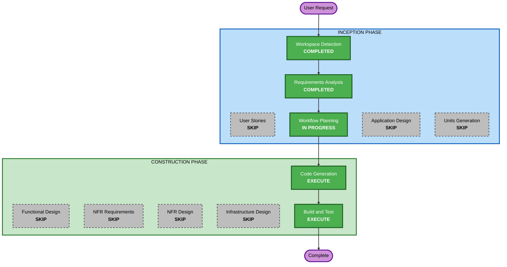

## Detailed Analysis Summary

### Change Impact Assessment
- **User-facing changes**: Yes - 新規アプリケーション（電話を通じたAI Agent対話）
- **Structural changes**: Yes - 新規アーキテクチャ（WebSocketブリッジパターン）
- **Data model changes**: No - 永続化なし、PoCスコープ
- **API changes**: Yes - 発信トリガー用HTTP API（新規）
- **NFR impact**: No - PoCのためNFR要件なし

### Risk Assessment
- **Risk Level**: Low（PoC、ローカル開発のみ、本番影響なし）
- **Rollback Complexity**: Easy（Greenfield、ロールバック不要）
- **Testing Complexity**: Simple（手動テスト、電話発信して会話確認）

## Workflow Visualization



### Text Alternative
```
Phase 1: INCEPTION
- Workspace Detection (COMPLETED)
- Requirements Analysis (COMPLETED)
- User Stories (SKIP)
- Workflow Planning (IN PROGRESS)
- Application Design (SKIP)
- Units Generation (SKIP)

Phase 2: CONSTRUCTION
- Functional Design (SKIP)
- NFR Requirements (SKIP)
- NFR Design (SKIP)
- Infrastructure Design (SKIP)
- Code Generation (EXECUTE)
- Build and Test (EXECUTE)
```

## Phases to Execute

### INCEPTION PHASE
- [x] Workspace Detection (COMPLETED)
- [x] Reverse Engineering - SKIP
  - **Rationale**: Greenfield プロジェクトのため不要
- [x] Requirements Analysis (COMPLETED)
- [x] User Stories - SKIP
  - **Rationale**: PoCスコープ。ユーザータイプは1種（オペレーター/開発者）のみ。アウトバウンドセールスのシナリオは要件ドキュメントで十分定義済み。
- [x] Workflow Planning (IN PROGRESS)
- [ ] Application Design - SKIP
  - **Rationale**: コンポーネント構成はシンプル（Node.jsサーバー1つ）で、要件ドキュメントのアーキテクチャ概要で十分。新規コンポーネント間の複雑な依存関係なし。
- [ ] Units Generation - SKIP
  - **Rationale**: 単一ユニット（1つのNode.jsアプリケーション）で構成されるため分割不要。

### CONSTRUCTION PHASE
- [ ] Functional Design - SKIP
  - **Rationale**: ビジネスロジックはシンプル（発信→音声ブリッジ→AI会話）。複雑なデータモデルやビジネスルールなし。
- [ ] NFR Requirements - SKIP
  - **Rationale**: PoCのためNFR要件なし。パフォーマンス・セキュリティ・スケーラビリティの制約なし。
- [ ] NFR Design - SKIP
  - **Rationale**: NFR Requirements をスキップするため不要。
- [ ] Infrastructure Design - SKIP
  - **Rationale**: ローカル開発環境のみ。クラウドインフラ設計不要。
- [ ] Code Generation - EXECUTE (ALWAYS)
  - **Rationale**: Part 1（計画）+ Part 2（実装）でコード生成を実施。
- [ ] Build and Test - EXECUTE (ALWAYS)
  - **Rationale**: ビルド手順とテスト手順の文書化。

### OPERATIONS PHASE
- [ ] Operations - PLACEHOLDER
  - **Rationale**: 将来の拡張用。PoCでは不要。

## Success Criteria
- **Primary Goal**: AI Agentが電話を発信し、日本語でリアルタイム双方向会話ができること
- **Key Deliverables**:
  - Node.js WebSocketブリッジサーバー
  - Twilio発信 + Media Streams 統合
  - OpenAI Realtime API 統合
  - 発信トリガー（CLI/HTTP API）
  - セットアップ手順書
- **Quality Gates**:
  - 電話が正常に発信されること
  - AI Agentの音声応答が聞こえること
  - 双方向の会話が成立すること
