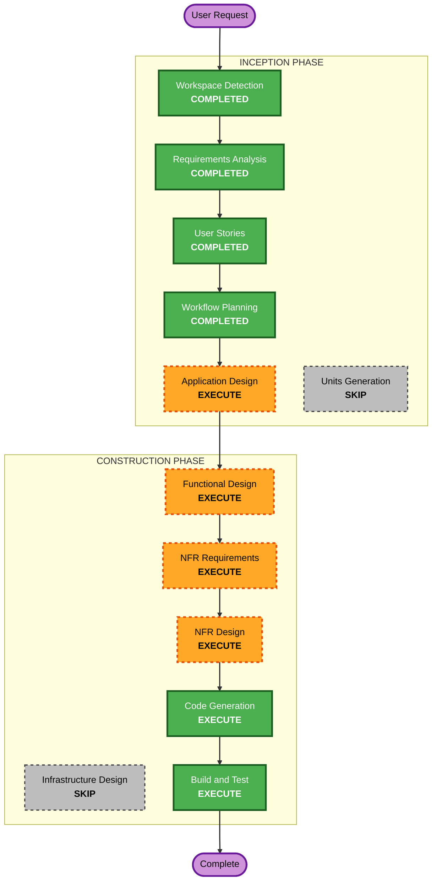

## Detailed Analysis Summary

### Change Impact Assessment
- **User-facing changes**: Yes - Slackチャンネルでの新しいBot対話体験
- **Structural changes**: Yes - 新規アプリケーション構築（Greenfield）
- **Data model changes**: No - データベース不使用（インメモリのみ）
- **API changes**: No - 外部APIは提供しない（Slack EventsとClaude API消費のみ）
- **NFR impact**: Yes - ストリーミング性能、Slack APIレートリミット制御

### Risk Assessment
- **Risk Level**: Medium
  - Claude Agent SDK v2はプレビュー版（API変更リスク）
  - Slack APIレートリミットの制御が必要
- **Rollback Complexity**: Easy（Greenfield、既存システムへの影響なし）
- **Testing Complexity**: Moderate（Slack API・Claude APIとの統合テストが必要）

---

## Workflow Visualization

### Mermaid Diagram



### Text Alternative

```
Phase 1: INCEPTION
  - Workspace Detection       (COMPLETED)
  - Requirements Analysis      (COMPLETED)
  - User Stories               (COMPLETED)
  - Workflow Planning          (COMPLETED)
  - Application Design         (EXECUTE)
  - Units Generation           (SKIP)

Phase 2: CONSTRUCTION
  - Functional Design          (EXECUTE)
  - NFR Requirements           (EXECUTE)
  - NFR Design                 (EXECUTE)
  - Infrastructure Design      (SKIP)
  - Code Generation            (EXECUTE)
  - Build and Test             (EXECUTE)

Phase 3: OPERATIONS
  - Operations                 (PLACEHOLDER)
```

---

## Phases to Execute

### INCEPTION PHASE
- [x] Workspace Detection (COMPLETED)
- [x] Reverse Engineering (SKIPPED - Greenfield)
- [x] Requirements Analysis (COMPLETED)
- [x] User Stories (COMPLETED)
- [x] Workflow Planning (COMPLETED)
- [ ] Application Design - **EXECUTE**
  - **Rationale**: 新規プロジェクトで複数コンポーネント（Slackハンドラー、Claudeハンドラー、セッションストア）の設計が必要。コンポーネント間の責務とインターフェースを定義する。
- [ ] Units Generation - **SKIP**
  - **Rationale**: 単一アプリケーション（Slack Bot）であり、マルチサービス分割の必要なし。1ユニットとして扱う。

### CONSTRUCTION PHASE
- [ ] Functional Design - **EXECUTE**
  - **Rationale**: ストリーミング応答のバッファリングロジック、セッション管理のライフサイクル、エラーハンドリングフローなど、ビジネスルールの詳細設計が必要。
- [ ] NFR Requirements - **EXECUTE**
  - **Rationale**: Slack APIレートリミット制御、ストリーミング更新頻度、セッションストアのインターフェース設計など、非機能要件の具体化が必要。
- [ ] NFR Design - **EXECUTE**
  - **Rationale**: NFR Requirementsで定義した要件に対する実装パターンの設計が必要。
- [ ] Infrastructure Design - **SKIP**
  - **Rationale**: ローカル実行（Bun + Socket Mode）のみ。クラウドインフラやデプロイアーキテクチャは対象外。
- [ ] Code Generation - **EXECUTE** (ALWAYS)
  - **Rationale**: アプリケーションコードの実装が必要。
- [ ] Build and Test - **EXECUTE** (ALWAYS)
  - **Rationale**: ビルド・テスト手順の作成が必要。

### OPERATIONS PHASE
- [ ] Operations - PLACEHOLDER
  - **Rationale**: 将来の拡張用。本番デプロイは対象外。

---

## Success Criteria
- **Primary Goal**: Slack上でClaude AIとリアルタイムにスレッドベースの会話ができるBot
- **Key Deliverables**:
  - 動作するSlack Bot（Bun + bolt-js + Claude Agent SDK v2）
  - Dev Container開発環境
  - ストリーミング応答機能
  - スレッドベースのセッション管理
- **Quality Gates**:
  - TypeScript strict mode準拠
  - `bun run` で正常起動
  - メンション → スレッド応答のE2Eフロー動作確認
