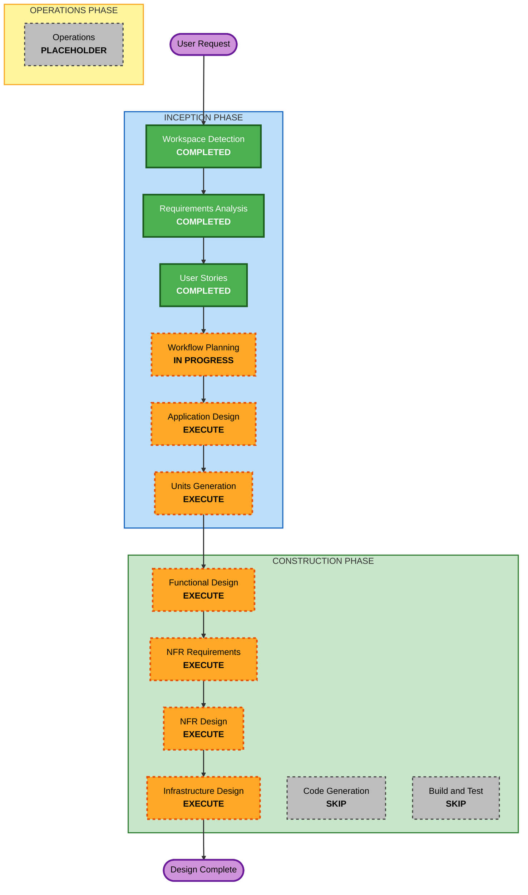

## Detailed Analysis Summary

### Change Impact Assessment
- **User-facing changes**: Yes — 新規Slackボットの構築。ユーザーがSlack上でAIと対話する新しい体験
- **Structural changes**: Yes — 完全新規のアプリケーションアーキテクチャ（Slack Adapter + AI Agent + State Management + Health/Logging）
- **Data model changes**: Yes — 会話履歴のRedisデータモデル設計が必要
- **API changes**: Yes — Slack Event API連携、ヘルスチェックHTTPエンドポイント
- **NFR impact**: Yes — 監視（ヘルスチェック）、ログ出力、Redis接続管理

### Risk Assessment
- **Risk Level**: Medium
- **理由**: 複数の外部SDK（vercel/chat、Claude Agent SDK）の統合、マルチエージェント設計。ただし設計フェーズのみのスコープなのでリスクは限定的
- **Rollback Complexity**: Easy（設計ドキュメントのみ）
- **Testing Complexity**: N/A（設計フェーズのみ）

---

## Workflow Visualization

### Mermaid Diagram



### Text Alternative

```
Phase 1: INCEPTION
  - Workspace Detection      [COMPLETED]
  - Requirements Analysis    [COMPLETED]
  - User Stories              [COMPLETED]
  - Workflow Planning         [IN PROGRESS]
  - Application Design       [EXECUTE]
  - Units Generation          [EXECUTE]

Phase 2: CONSTRUCTION
  - Functional Design         [EXECUTE]
  - NFR Requirements          [EXECUTE]
  - NFR Design                [EXECUTE]
  - Infrastructure Design     [EXECUTE]
  - Code Generation           [SKIP]
  - Build and Test            [SKIP]

Phase 3: OPERATIONS
  - Operations                [PLACEHOLDER]
```

---

## Phases to Execute

### INCEPTION PHASE
- [x] Workspace Detection (COMPLETED)
- [x] Reverse Engineering — SKIPPED（Greenfield）
- [x] Requirements Analysis (COMPLETED)
- [x] User Stories (COMPLETED)
- [x] Workflow Planning (IN PROGRESS)
- [ ] Application Design — **EXECUTE**
  - **Rationale**: 新規コンポーネント（Slack Adapter、AI Agent、State Manager、Health Check）の設計が必要。コンポーネント間の責務・インターフェースの定義が重要
- [ ] Units Generation — **EXECUTE**
  - **Rationale**: 複数のサービス/モジュールに分解が必要。ユニット単位でConstruction Phaseを進めるための構造化

### CONSTRUCTION PHASE
- [ ] Functional Design — **EXECUTE**
  - **Rationale**: 会話フロー、エージェントルーティング、状態管理のビジネスロジック設計が必要
- [ ] NFR Requirements — **EXECUTE**
  - **Rationale**: ヘルスチェック（US-6.1）、構造化ログ（US-6.2）、Redis接続管理等のNFRを具体化する必要がある
- [ ] NFR Design — **EXECUTE**
  - **Rationale**: NFR Requirementsで定義した要件をアーキテクチャパターンに落とし込む
- [ ] Infrastructure Design — **EXECUTE**
  - **Rationale**: AWSデプロイアーキテクチャ（ECS/Fargate等）、Redis（ElastiCache）、ネットワーク構成の設計
- [ ] Code Generation — **SKIP**
  - **Rationale**: 要件により設計フェーズまでがスコープ。コード実装は別リポジトリで実施
- [ ] Build and Test — **SKIP**
  - **Rationale**: コード生成をスキップするため、ビルド・テストも対象外

### OPERATIONS PHASE
- [ ] Operations — PLACEHOLDER

---

## Success Criteria
- **Primary Goal**: Slack AI Chatbotの完全な設計ドキュメントを生成する
- **Key Deliverables**:
  - Application Design（コンポーネント設計、インターフェース定義）
  - Units分割（実装ユニットの定義）
  - Functional Design（ビジネスロジック詳細設計）
  - NFR Requirements & Design（非機能要件設計）
  - Infrastructure Design（AWS構成設計）
- **Quality Gates**:
  - 全コンポーネントの責務・インターフェースが明確に定義されていること
  - 設計ドキュメントがコード実装の着手に十分な詳細度を持つこと
  - NFR（監視・ログ）が設計に組み込まれていること
