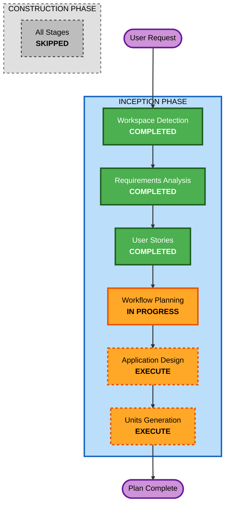

# Execution Plan

## Detailed Analysis Summary

### Change Impact Assessment
- **User-facing changes**: Yes - Slack上での新しいインタラクション体験
- **Structural changes**: Yes - 新規システムの構築（マルチエージェントアーキテクチャ）
- **Data model changes**: Yes - ミーティング状態、Plan、タスク仕様のデータモデル
- **API changes**: Yes - Slack Events API、GitHub API、Devin連携
- **NFR impact**: Yes - Slack応答速度、Agent間通信の信頼性

### Risk Assessment
- **Risk Level**: Medium
  - 外部サービス依存（Slack、GitHub、Devin）が多く、API仕様変更リスクあり
  - Strands Agentsフレームワークの成熟度による制約の可能性
- **Rollback Complexity**: Easy（Greenfield、既存システムへの影響なし）
- **Testing Complexity**: Moderate（外部サービス連携のモック/スタブが必要）

## Workflow Visualization



### Text Alternative
```
Phase: INCEPTION
- Workspace Detection (COMPLETED)
- Requirements Analysis (COMPLETED)
- User Stories (COMPLETED)
- Workflow Planning (IN PROGRESS)
- Application Design (EXECUTE)
- Units Generation (EXECUTE)

Phase: CONSTRUCTION
- All Stages (SKIPPED - per user request, plan only)
```

## Phases to Execute

### INCEPTION PHASE
- [x] Workspace Detection (COMPLETED)
- [x] Requirements Analysis (COMPLETED)
- [x] User Stories (COMPLETED)
- [x] Workflow Planning (IN PROGRESS)
- [ ] Application Design - **EXECUTE**
  - **Rationale**: 新規システム。Slack Bot、Agent Orchestrator、GitHub/Devin連携など複数コンポーネントの設計が必要。コンポーネント間のインターフェースとデータフローを定義する。
- [ ] Units Generation - **EXECUTE**
  - **Rationale**: システムが複数の独立したコンポーネント（Slack連携、Agent Orchestration、GitHub連携、Devin連携）で構成され、それぞれが異なる技術的関心事を持つため、Unitへの分解が有益。

### CONSTRUCTION PHASE - SKIPPED
- ~~Functional Design~~ - **SKIP** (ユーザー指示: Planまでで実装なし)
- ~~NFR Requirements~~ - **SKIP** (同上)
- ~~NFR Design~~ - **SKIP** (同上)
- ~~Infrastructure Design~~ - **SKIP** (同上)
- ~~Code Generation~~ - **SKIP** (同上)
- ~~Build and Test~~ - **SKIP** (同上)

### OPERATIONS PHASE - SKIPPED
- ~~Operations~~ - **PLACEHOLDER**

## Success Criteria
- **Primary Goal**: AI Agent Teamシステムの包括的な設計ドキュメント（Plan）の完成
- **Key Deliverables**:
  - 要件ドキュメント (COMPLETED)
  - ユーザーストーリー (COMPLETED)
  - Application Design（コンポーネント設計、データフロー、インターフェース定義）
  - Units Generation（実装Unit分解、依存関係、実装順序）
- **Quality Gates**:
  - 全要件がApplication Designでカバーされていること
  - 各Unitが独立して実装可能なサイズであること
  - Devin投入時のタスク仕様として十分な情報が含まれること
